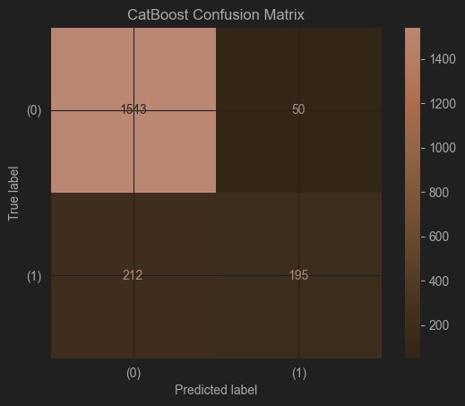
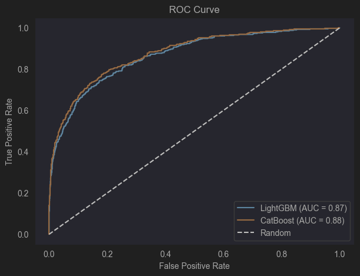
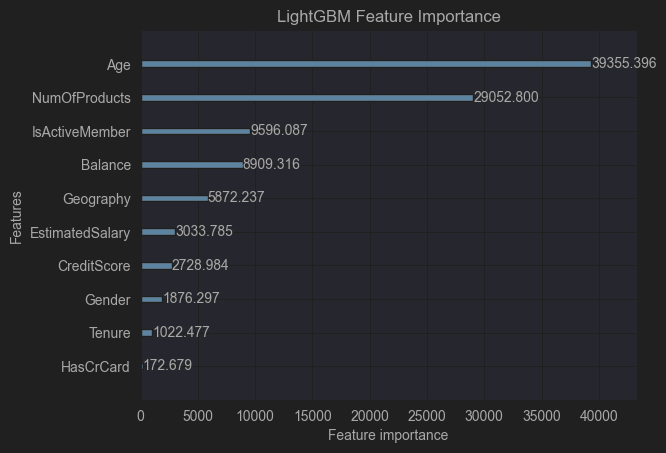
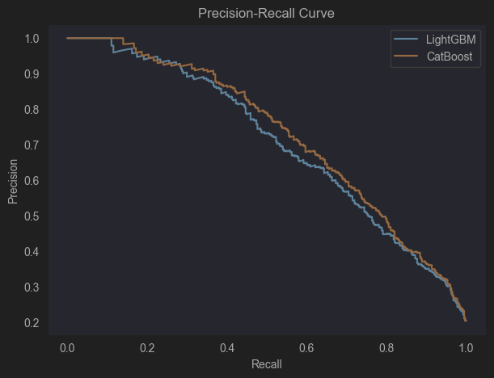

## SKN14-2nd-2Team - 🏦 고객 이탈(Churn) 예측 프로젝트 (김진묵 작성 버전)

## 프로젝트 개요

- **목적:**  
  은행/신용카드사의 고객 이탈(Churn) 위험을 조기에 예측하여,  
  데이터 기반 맞춤 케어와 마케팅 전략 수립에 활용
- **데이터:**  
  [Churn_Modelling.csv](https://ppl-ai-file-upload.s3.amazonaws.com/web/direct-files/attachments/66017198/4673012c-a6ff-486a-b9aa-7ebdddd3687b/Churn_Modelling.csv)  
  (10,000명 고객의 인구통계, 금융거래, 이탈여부 등)

---

## 1. 데이터 및 주요 변수

| 변수명         | 설명                                 |
|----------------|-------------------------------------|
| CreditScore    | 신용점수                            |
| Geography      | 지역(France, Spain, Germany)        |
| Gender         | 성별                                |
| Age            | 나이                                |
| Tenure         | 거래기간(년)                        |
| Balance        | 잔고                                |
| NumOfProducts  | 보유 상품수                         |
| HasCrCard      | 신용카드 보유 여부                  |
| IsActiveMember | 활성회원 여부                       |
| EstimatedSalary| 추정 연봉                           |
| Exited         | 이탈여부(1=이탈, 0=잔류)            |

---

## 2. 데이터 인사이트 요약

- **전체 이탈률:** 20.4%
- **지역별:** Germany(32.4%) > France(16.1%) ≈ Spain(16.2%)
- **성별:** 여성(25.5%) > 남성(16.1%)
- **나이대별:** 나이 많을수록 이탈률↑ (60대 이상 38.6%)
- **상품수별:** 1개(28.5%), 2개(7.9%), 3개(27.2%), 4개(73.0%)
- **잔고별:** 잔고 높을수록 이탈률↑
- **활성회원:** 비활성(26.1%) > 활성(14.3%)

---

## 3. 주요 인사이트 해석

- **이탈 고위험군:**  
  - Germany, 여성, 50~60대, 상품 1개/4개, 비활성, 고잔고 고객
- **이탈률이 높은 이유:**  
  - 해당 그룹에 이탈 위험 특성이 집중되어 있음(지역 자체 문제 아님)
  - 고령/고잔고 고객은 기대치·협상력 높고, 스위칭이 쉬움
- **상품수별:**  
  - 2개 보유 고객이 가장 안정적, 1/4개는 관계 약화·복잡성으로 이탈↑

---

## 4. 모델링 및 하이퍼파라미터 튜닝 (김진묵)

- **모델:** LightGBM, CatBoost
- **튜닝:**  
  - RandomizedSearchCV → GridSearchCV 2단계로 최적 파라미터 탐색

- LightGBM 최종 Best Params: {'learning_rate': np.float64(0.015831900532851405), 'max_depth': 4, 'n_estimators': 489, 'num_leaves': 69}

- CatBoost 최종 Best Params: {'depth': 5, 'iterations': 659, 'l2_leaf_reg': np.float64(5.693225283906248), 'learning_rate': np.float64(0.013695913252732178)}

- LightGBM Classification Report:
               precision    recall  f1-score   support

           0       0.88      0.97      0.92      1593
           1       0.78      0.46      0.58       407

    accuracy                           0.86      2000
   macro avg       0.83      0.71      0.75      2000
weighted avg       0.86      0.86      0.85      2000

LightGBM ROC AUC: 0.8656499334465436

- CatBoost Classification Report:
               precision    recall  f1-score   support

           0       0.88      0.97      0.92      1593
           1       0.80      0.48      0.60       407

    accuracy                           0.87      2000
   macro avg       0.84      0.72      0.76      2000
weighted avg       0.86      0.87      0.86      2000

CatBoost ROC AUC: 0.8761427066511812

- **최종 성능 (테스트셋 기준):**
  - **LightGBM:**  
    - Accuracy: 0.86, ROC AUC: 0.87, 이탈 Recall: 0.46, Precision: 0.78
  - **CatBoost:**  
    - Accuracy: 0.87, ROC AUC: 0.88, 이탈 Recall: 0.48, Precision: 0.80

---

## 2. **클래스별(이탈/잔류) 평가**

| 모델      | 클래스 | Precision | Recall | F1-score | 지원(Support) |
|-----------|--------|-----------|--------|----------|---------------|
| LightGBM  | 0(잔류)   | 0.88      | 0.97   | 0.92     | 1593          |
| LightGBM  | 1(이탈)   | 0.78      | 0.46   | 0.58     | 407           |
| CatBoost  | 0(잔류)   | 0.88      | 0.97   | 0.92     | 1593          |
| CatBoost  | 1(이탈)   | 0.80      | 0.48   | 0.60     | 407           |

- **잔류(0) 고객**
  - Precision, Recall, F1 모두 매우 높음 (0.92 이상)
  - 즉, 잔류 고객은 매우 잘 맞춤

- **이탈(1) 고객**
  - Precision: 0.78~0.80 (예측한 이탈 고객 중 실제 이탈 비율)
  - Recall: 0.46~0.48 (실제 이탈 고객 중 모델이 맞춘 비율)
  - F1-score: 0.58~0.60 (Precision과 Recall의 조화 평균)
  - → **이탈 고객 예측은 잔류보다 어렵지만, CatBoost가 약간 더 우수**

---

### 1. **비즈니스적 해석**

- **이탈 고객 Recall(0.46~0.48)**  
  : 실제 이탈 고객의 약 절반을 모델이 잡아냅니다.  
  (이탈 고객을 100명 중 46~48명은 맞춘다는 뜻)
- **이탈 고객 Precision(0.78~0.80)**  
  : 모델이 “이탈”이라고 예측한 고객 10명 중 8명은 실제로 이탈합니다.  
  (불필요한 마케팅 비용이 적음)
- **잔류 고객은 거의 완벽하게 예측**  
  : 불필요한 잔류 고객에게 이탈 방지 마케팅을 할 확률이 매우 낮음

---

### 2. **모델간 비교**

- **CatBoost가 LightGBM보다 이탈 고객 예측에서 약간 더 좋은 성능**  
  (Recall, F1-score, ROC AUC 모두 CatBoost가 소폭 우위)
- **두 모델 모두 실무에 적용 가능한 수준**

---

### 3. **실무적 시사점**

- **이탈 위험 고객(모델이 1로 예측한 고객) 리스트를 추출해  
  집중 케어, 마케팅, 상담 등 실제 액션에 활용**할 수 있습니다.
- **이탈 Recall이 0.5 미만이므로,  
  더 높은 Recall이 필요하다면 임계값(threshold) 조정, 데이터 증강, 추가 변수 발굴 등 고도화 필요**

---

#### 요약

- **모델 성능은 매우 우수** (특히 CatBoost)
- **이탈 고객의 절반 정도를 정확히 잡아낼 수 있음**
- **실제 마케팅/상담팀에서 이탈 위험군 타겟팅에 활용 가능**
- **더 높은 Recall이 필요하다면 추가적인 모델 개선 가능**

---

---

## 5. 성능 시각화

- **Confusion Matrix, ROC Curve, Feature Importance** 등 시각화  
  
- 
- 
- 
- 
- 

---

## 6. 실무적 시사점 및 대응방안

이탈률이 가장 높은 그룹 Top 3
Germany, Female, 4개 상품 보유: 91.3%

60대 이상, 비활성회원: 44.2%

잔고 15~20만, 비활성회원: (구간별 조합 분석 필요)

인사이트 요약
Germany, Female, 상품 4개 보유, 비활성, 고령층에서 이탈률이 매우 높음

잔고, 나이, 상품수가 높아질수록 이탈률이 증가하는 경향

연봉(EstimatedSalary)는 이탈률에 큰 영향이 없음

활성회원, 상품 2개 보유, 신용점수 최상 그룹은 이탈률이 낮음

추가 분석 아이디어
이탈 고객의 평균 나이, 평균 잔고, 평균 신용점수 등

이탈 고객의 상위 10% 특성(예: 평균 연령, 평균 상품수 등)

복합 조건(예: Germany+여성+비활성+잔고 10만 이상)의 이탈률

대응 방안
---

## 1. 상품수(NumOfProducts)별 대응방안

**인사이트:**  
- 상품 1개 또는 4개 보유 고객의 이탈률이 매우 높음  
- 상품 2개 보유 고객은 이탈률이 가장 낮음

**대응방안:**  
- **상품 1개 고객:**  
  - 추가 상품(예: 체크카드, 예적금, 보험 등) 번들 프로모션 제공  
  - “2개 이상 상품 보유 시 연회비 면제/포인트 추가 적립” 등 혜택
  - 상담사 통한 상품 추천 및 가입 유도
- **상품 4개 고객:**  
  - 상품 복잡성/불만 해소를 위한 1:1 상담 제공  
  - 상품 통합, 단순화, 맞춤형 혜택 제안
- **상품 2개 고객:**  
  - 우수고객 프로그램 운영, 지속적 만족도 관리

**실제 사례:**  
- **국내 카드사 A사:** “카드+적금” 등 패키지 가입 시 연회비 면제, 캐시백 제공  
- **미국 은행 Wells Fargo:** 상품 1개 고객 대상 ‘추가 상품 가입 시 혜택’ 캠페인 진행

---

## 2. 나이(Age)별 대응방안

**인사이트:**  
- 50대 이상, 특히 60대 이상 이탈률이 급증  
- 20~30대는 이탈률이 낮음

**대응방안:**  
- **고령층(50~60대 이상):**  
  - 전담 상담사/매니저 배정, 오프라인 창구/콜센터 지원 강화
  - 이해하기 쉬운 안내문, 맞춤형 금융교육 제공
  - 고령층 전용 상품(간편결제, 생활밀착형 혜택 등) 출시
- **젊은층(20~30대):**  
  - 디지털 채널(앱, 챗봇) 중심의 커뮤니케이션
  - 라이프스타일 맞춤 혜택(여행, 쇼핑, 구독 서비스 등) 제공

**실제 사례:**  
- **HSBC:** 60대 이상 고객 전용 창구, 금융교육 세미나 운영  
- **신한카드:** 2030 전용 카드 출시, 앱 기반 이벤트 강화

---

## 3. 지역(Geography)별 대응방안

**인사이트:**  
- Germany 지역 이탈률이 France, Spain 대비 월등히 높음

**대응방안:**  
- **Germany 등 고이탈 지역:**  
  - 현지화된 상품/서비스(언어, 문화 반영) 제공
  - 현지 전담 콜센터, VIP 서비스, 오프라인 이벤트 강화
  - 불만/민원 신속 처리 시스템 도입
- **이탈률 낮은 지역:**  
  - 기존 서비스 유지, 비용 효율적 관리

**실제 사례:**  
- **글로벌 카드사 Amex:** 국가별 맞춤 프로모션, 현지 언어 상담센터 운영  
- **국내 은행:** 해외지점별 VIP 고객 전담팀 운영

---

## 4. 성별(Gender)별 대응방안

**인사이트:**  
- 여성(Female) 고객의 이탈률이 남성(Male)보다 높음

**대응방안:**  
- **여성 고객:**  
  - 여성 특화 상품(여행, 쇼핑, 뷰티, 육아 등) 및 혜택 제공
  - 여성 전용 상담사, 커뮤니티, 이벤트 운영
  - 라이프스타일 분석 기반 맞춤형 마케팅
- **남성 고객:**  
  - 스포츠, 자동차, 금융투자 등 관심사 기반 혜택 제공

**실제 사례:**  
- **삼성카드:** 여성 특화 카드(쇼핑, 뷰티, 육아 할인) 출시  
- **신한은행:** 여성 VIP 고객 전용 세미나, 멤버십 운영

---

## 5. 잔고(Balance)별 대응방안

**인사이트:**  
- 잔고가 높을수록 이탈률이 증가하는 경향  
- 고잔고 고객은 LTV(고객생애가치)가 높음

**대응방안:**  
- **고잔고 고객:**  
  - VIP 등급 부여, 프라이빗뱅킹(PB) 서비스 제공
  - 맞춤형 금융상품(자산관리, 투자, 세무 등) 추천
  - 수수료 우대, 전용 상담사, 프리미엄 이벤트 초청
- **저잔고 고객:**  
  - 자동이체, 소액 적립 등 잔고 증대 유도
  - 기본 혜택 중심 관리
-연회비/실적 조건 없음 또는 매우 낮음
“누구나 받을 수 있는 생활 할인” (커피, 편의점, 교통, 통신비 등)
단순한 포인트 적립, 캐시백 등
연회비/실적 조건 없음 또는 매우 낮음
**국내 카드사 사례**
**신한카드 Deep Dream 체크카드**
실적 조건 없이 커피, 편의점 등 생활 할인 제공
**카카오뱅크 mini카드**
10대/20대 대상, 실적 조건 없이 교통·편의점 할인
**해외 사례**
**Chase Freedom Student Card (미국)**
연회비 없음, 실적 조건 없이 소액 결제 캐시백
**Revolut Standard Card (영국)**
계좌 잔고와 상관없이 기본 해외 결제 수수료 무료, 소액 결제 혜택
“누구나 받을 수 있는 생활 할인” (커피, 편의점, 교통, 통신비 등)
단순한 포인트 적립, 캐시백 등
**실제 사례:**  
- **KB국민은행:** 고잔고 고객 PB 전담, 자산관리 세미나 제공  
- **씨티은행:** 프라이빗뱅킹 고객 전용 상품, 수수료 면제

---

## 요약
- **고위험군 타겟팅:**  
  - Germany, 여성, 고령, 상품 1/4개, 비활성, 고잔고 고객에 맞춤 혜택·상담 제공
- **상품 전략:**  
  - 1개 고객: 번들/패키지 추천, 4개 고객: 상품 단순화/정리 상담
- **고령층:**  
  - 오프라인/전담 상담, 시니어 전용 상품/혜택
- **저잔고:**  
  - 실적 조건 없는 간단한 혜택 카드 출시(실제 카드사 사례 참고)
- **모델 실무 적용:**  
  - 이탈 위험 고객 리스트 추출 → 마케팅/상담팀 전달 및 집중 관리
  - 머신러닝 이탈 예측 모델을 활용해 각 그룹별 위험고객을 실시간 탐지  
  - 고위험군은 전담팀이 즉각적·맞춤형 케어  
  - 상품, 서비스, 마케팅, 상담 등 전사적 협업 필요

---

### 요약 표

| 구분     | 고이탈 그룹 인사이트             | 대응방안 예시                                         | 실제 사례                          |
|----------|-------------------------------|------------------------------------------------------|-------------------------------------|
| 상품수   | 1개/4개 보유 이탈률 높음       | 번들/패키지 추천, 상품 단순화, 우대혜택              | Wells Fargo, 국내 카드사            |
| 나이     | 50~60대 이상 이탈률 높음       | 고령층 전담 상담, 전용 상품, 금융교육                | HSBC, 신한카드                      |
| 지역     | Germany 등 특정국가 이탈률↑    | 현지화 서비스, 전담 콜센터, VIP 관리                 | Amex, 국내 은행                     |
| 성별     | 여성 이탈률 높음               | 여성 특화 상품/혜택, 전용 이벤트                     | 삼성카드, 신한은행                  |
| 잔고     | 잔고 높을수록 이탈률↑          | VIP/PB 서비스, 맞춤 자산관리, 수수료 우대            | KB국민은행, 씨티은행                |

---

---

## 7. 실제 금융권 대응 사례

- **국내 카드사 A사:**  
  - 이탈 예측 모델로 위험군 추출, 맞춤 리텐션 캠페인(연회비 면제, 캐시백 등)
- **HSBC:**  
  - 고위험군 실시간 모니터링, VIP 서비스, 불만 신속 처리
- **Wells Fargo:**  
  - 상품 번들, 이탈 방지 전담팀 운영

---

## 8. 프로젝트 구조 
---

## 9. 실행 방법

## 10. 참고/확장 아이디어

- 임계값 조정, SMOTE 등 데이터 불균형 개선
- SHAP 등 모델 해석 강화
- 실시간 이탈 예측 및 자동화 적용
