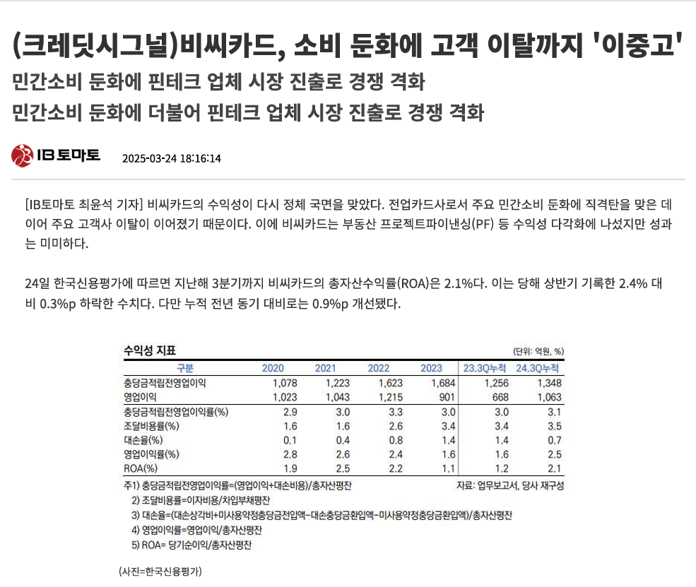
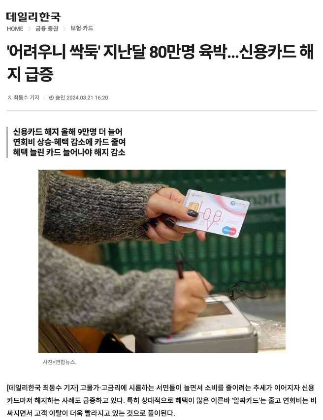
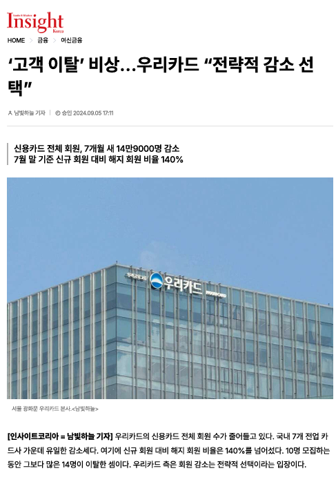

# SKN14-2nd-2Team - 🏦 고객 이탈(Churn) 예측 프로젝트

  

## 프로젝트 소개

### ✅ **프로젝트 개요**

- 목적: 은행/신용카드사의 고객 이탈(Churn) 위험을 조기에 예측하여, 데이터 기반 맞춤 케어와 마케팅 전략 수립에 활용
- 데이터 출처: [Kaggle - Credit Card Customer Churn Prediction](https://www.kaggle.com/datasets/rjmanoj/credit-card-customer-churn-prediction)
- 데이터 구성: 총 14개 컬럼, (10,000명 고객의 인구통계, 금융거래, 이탈여부 등)

이 프로젝트는 유럽 은행 고객 모집단 10000명의 인구통계 및 개인 데이터를 사용하여  
은행에서 고객 이탈을 예측하는 효율적인 모델을 제공하는 것을 목표하며 고객 유치를 위한 대응방안을 제시하고자 합니다.

### ✅ **프로젝트 배경**

은행 입장에서 신규 고객을 모집하는 것은 기존 고객을 유지하는 것보다 비용이 더 많이 들 수 있습니다.  

또한 고객 유지율을 5%만 높여도 은행의 수익이 적어도 25%이상 향상될 수 있다는 연구사실이 있습니다.  
[research done by Frederick Reichheld of Bain & Company](https://media.bain.com/Images/BB_Prescription_cutting_costs.pdf)

이러한 배경 속에서 신규 고객을 모집하는 것 이상으로 기존 고객을 유지하는 것은   은행에서 가장 중요한 문제 중 하나가 되었습니다.

## 팀소개

|  |  |  |  |  |
|--|--|--|--|--|
|  **김준기** [@rwr9857](https://github.com/rwr9857)  |  **송지훈** [@teolex](https://github.com/teolex) |  **조성재** [@sungjaecho98](https://github.com/sungjaecho98) |  **김진묵** [@jinmukkim](https://github.com/jinmukkim) |  **이재혁** [@jayHuggie](https://github.com/jayHuggie)|

## 기술스택

### AI & 데이터 처리

### 실험 및 개발 환경

### 대시보드 & 프론트엔드

### 머신러닝 모델
 

### 버전 관리 및 협업

 

## 탐색적 데이터 분석(EDA)

### 1. 데이터 기본 정보

| 변수명         | 설명                                 |
|----------------|-------------------------------------|
| RowNumber      | 행 번호 (각 행의 고유 번호)              |
| CustomerId     | 고객 ID (고객 고유 식별자)               |
| Surname        | 성 (고객의 성씨)                       |
| CreditScore    | 신용점수                             |
| Geography      | 지역(France, Spain, Germany)        |
| Gender         | 성별                                |
| Age            | 나이                                |
| Tenure         | 거래기간(년)                         |
| Balance        | 잔고                               |
| NumOfProducts  | 보유 상품수                         |
| HasCrCard      | 신용카드 보유 여부                  |
| IsActiveMember | 활성회원 여부                       |
| EstimatedSalary| 추정 연봉                           |
| Exited         | 이탈여부(1=이탈, 0=잔류)            |
---

### 2. 데이터 인사이트 요약

- **전체 이탈률:** 20.4%
- **지역별:** Germany(32.4%) > France(16.1%) ≈ Spain(16.2%)
- **성별:** 여성(25.5%) > 남성(16.1%)
- **나이대별:** 나이 많을수록 이탈률↑ (60대 이상 38.6%)
- **상품수별:** 1개(28.5%), 2개(7.9%), 3개(27.2%), 4개(73.0%)
- **잔고별:** 잔고 높을수록 이탈률↑
- **활성회원:** 비활성(26.1%) > 활성(14.3%)

---

### 3. 주요 인사이트 해석

- **이탈 고위험군:**  
  - Germany, 여성, 50~60대, 상품 1개/4개, 비활성, 고잔고 고객
- **이탈률이 높은 이유:**  
  - 해당 그룹에 이탈 위험 특성이 집중되어 있음(지역 자체 문제 아님)
  - 고령/고잔고 고객은 기대치·협상력 높고, 스위칭이 쉬움
- **상품수별:**  
  - 2개 보유 고객이 가장 안정적, 1/4개는 관계 약화·복잡성으로 이탈↑

## 대응방안

### 1. 상품수(NumOfProducts)별 대응방안

**인사이트:**  
- 상품 1개 또는 4개 보유 고객의 이탈률이 매우 높음  
- 상품 2개 보유 고객은 이탈률이 가장 낮음

**대응방안:**  
- **상품 1개 고객:**  
  - 추가 상품(예: 체크카드, 예적금, 보험 등) 번들 프로모션 제공  
  - “2개 이상 상품 보유 시 연회비 면제/포인트 추가 적립” 등 혜택
  - 상담사 통한 상품 추천 및 가입 유도
- **상품 4개 고객:**  
  - 상품 복잡성/불만 해소를 위한 1:1 상담 제공  
  - 상품 통합, 단순화, 맞춤형 혜택 제안
- **상품 2개 고객:**  
  - 우수고객 프로그램 운영, 지속적 만족도 관리

**실제 사례:**  
- **국내 카드사 A사:** “카드+적금” 등 패키지 가입 시 연회비 면제, 캐시백 제공  
- **미국 은행 Wells Fargo:** 상품 1개 고객 대상 ‘추가 상품 가입 시 혜택’ 캠페인 진행

---

### 2. 나이(Age)별 대응방안

**인사이트:**  
- 50대 이상, 특히 60대 이상 이탈률이 급증  
- 20~30대는 이탈률이 낮음

**대응방안:**  
- **고령층(50~60대 이상):**  
  - 전담 상담사/매니저 배정, 오프라인 창구/콜센터 지원 강화
  - 이해하기 쉬운 안내문, 맞춤형 금융교육 제공
  - 고령층 전용 상품(간편결제, 생활밀착형 혜택 등) 출시
- **젊은층(20~30대):**  
  - 디지털 채널(앱, 챗봇) 중심의 커뮤니케이션
  - 라이프스타일 맞춤 혜택(여행, 쇼핑, 구독 서비스 등) 제공

**실제 사례:**  
- **HSBC:** 60대 이상 고객 전용 창구, 금융교육 세미나 운영  
- **신한카드:** 2030 전용 카드 출시, 앱 기반 이벤트 강화

---

### 3. 지역(Geography)별 대응방안

**인사이트:**  
- Germany 지역 이탈률이 France, Spain 대비 월등히 높음

**대응방안:**  
- **Germany 등 고이탈 지역:**  
  - 현지화된 상품/서비스(언어, 문화 반영) 제공
  - 현지 전담 콜센터, VIP 서비스, 오프라인 이벤트 강화
  - 불만/민원 신속 처리 시스템 도입
- **이탈률 낮은 지역:**  
  - 기존 서비스 유지, 비용 효율적 관리

**실제 사례:**  
- **글로벌 카드사 Amex:** 국가별 맞춤 프로모션, 현지 언어 상담센터 운영  
- **국내 은행:** 해외지점별 VIP 고객 전담팀 운영

---

### 4. 성별(Gender)별 대응방안

**인사이트:**  
- 여성(Female) 고객의 이탈률이 남성(Male)보다 높음

**대응방안:**  
- **여성 고객:**  
  - 여성 특화 상품(여행, 쇼핑, 뷰티, 육아 등) 및 혜택 제공
  - 여성 전용 상담사, 커뮤니티, 이벤트 운영
  - 라이프스타일 분석 기반 맞춤형 마케팅
- **남성 고객:**  
  - 스포츠, 자동차, 금융투자 등 관심사 기반 혜택 제공

**실제 사례:**  
- **삼성카드:** 여성 특화 카드(쇼핑, 뷰티, 육아 할인) 출시  
- **신한은행:** 여성 VIP 고객 전용 세미나, 멤버십 운영

---

### 5. 잔고(Balance)별 대응방안

**인사이트:**  
- 잔고가 높을수록 이탈률이 증가하는 경향  
- 고잔고 고객은 LTV(고객생애가치)가 높음

**대응방안:**  
- **고잔고 고객:**  
  - VIP 등급 부여, 프라이빗뱅킹(PB) 서비스 제공
  - 맞춤형 금융상품(자산관리, 투자, 세무 등) 추천
  - 수수료 우대, 전용 상담사, 프리미엄 이벤트 초청
- **저잔고 고객:**  
  - 자동이체, 소액 적립 등 잔고 증대 유도
  - 기본 혜택 중심 관리
  - 연회비/실적 조건 없음 또는 매우 낮음
  - "누구나 받을 수 있는 생활 할인" (커피, 편의점, 교통, 통신비 등)
  - 단순한 포인트 적립, 캐시백 등

**국내 카드사 사례**

**신한카드 Deep Dream 체크카드**
실적 조건 없이 커피, 편의점 등 생활 할인 제공

**카카오뱅크 mini카드**
10대/20대 대상, 실적 조건 없이 교통·편의점 할인

**해외 사례**

**Chase Freedom Student Card (미국)**
> 연회비 없음, 실적 조건 없이 소액 결제 캐시백

**Revolut Standard Card (영국)**   
> 계좌 잔고와 상관없이 기본 해외 결제 수수료 무료, 소액 결제 혜택  
> “누구나 받을 수 있는 생활 할인” (커피, 편의점, 교통, 통신비 등)  
> 단순한 포인트 적립, 캐시백 등

**실제 사례:**  
- **KB국민은행:** 고잔고 고객 PB 전담, 자산관리 세미나 제공  
- **씨티은행:** 프라이빗뱅킹 고객 전용 상품, 수수료 면제

---

### 요약
- **고위험군 타겟팅:**  
  - Germany, 여성, 고령, 상품 1/4개, 비활성, 고잔고 고객에 맞춤 혜택·상담 제공
- **상품 전략:**  
  - 1개 고객: 번들/패키지 추천, 4개 고객: 상품 단순화/정리 상담
- **고령층:**  
  - 오프라인/전담 상담, 시니어 전용 상품/혜택
- **저잔고:**  
  - 실적 조건 없는 간단한 혜택 카드 출시(실제 카드사 사례 참고)
- **모델 실무 적용:**  
  - 이탈 위험 고객 리스트 추출 → 마케팅/상담팀 전달 및 집중 관리
  - 머신러닝 이탈 예측 모델을 활용해 각 그룹별 위험고객을 실시간 탐지  
  - 고위험군은 전담팀이 즉각적·맞춤형 케어  
  - 상품, 서비스, 마케팅, 상담 등 전사적 협업 필요

---

### 요약 표

| 구분     | 고이탈 그룹 인사이트             | 대응방안 예시                                         | 실제 사례                          |
|----------|-------------------------------|------------------------------------------------------|-------------------------------------|
| 상품수   | 1개/4개 보유 이탈률 높음       | 번들/패키지 추천, 상품 단순화, 우대혜택              | Wells Fargo, 국내 카드사            |
| 나이     | 50~60대 이상 이탈률 높음       | 고령층 전담 상담, 전용 상품, 금융교육                | HSBC, 신한카드                      |
| 지역     | Germany 등 특정국가 이탈률↑    | 현지화 서비스, 전담 콜센터, VIP 관리                 | Amex, 국내 은행                     |
| 성별     | 여성 이탈률 높음               | 여성 특화 상품/혜택, 전용 이벤트                     | 삼성카드, 신한은행                  |
| 잔고     | 잔고 높을수록 이탈률↑          | VIP/PB 서비스, 맞춤 자산관리, 수수료 우대            | KB국민은행, 씨티은행                |

---
[참고문헌]

[Customer Churn Prediction Model Using Artificial
Neural Networks (ANN): A Case Study in Banking](https://repository.uel.ac.uk/download/ea69ce42c059e182b9a79d2a96f482e7b345e3b10dc5a8e30fd2ead056b51cb2/916223/Final%20Paper%20V5.pdf)
